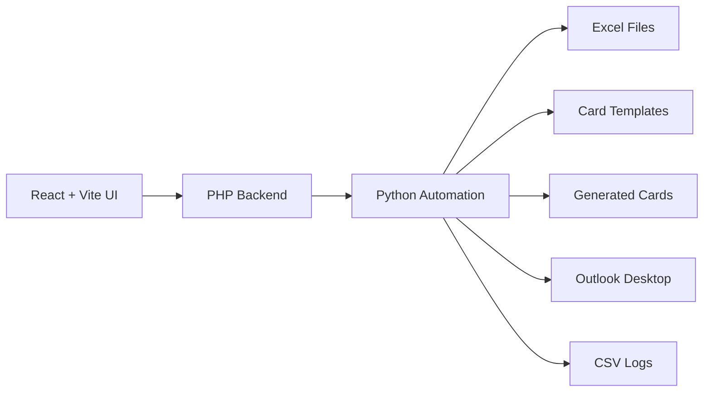

# Birthday Card Automation

Sistema para importar aniversariantes via Excel, gerar cartoes personalizados e automatizar envios por e-mail com Outlook.

## Overview

Este projeto foi pensado como uma solucao real de escritorio e tambem como portfolio tecnico. O objetivo e eliminar o processo manual de abrir arte no Photoshop, trocar nome, exportar imagem e montar e-mail um por um.

O sistema hoje suporta dois fluxos independentes dentro do mesmo painel:

- `Associado`
- `Diretoria`

Cada fluxo possui:

- planilha propria
- template anual proprio
- mensagem de e-mail propria
- historico proprio

## Why This Project Is Strong For Portfolio

Este repositorio demonstra:

- frontend moderno com `React + Vite`
- backend local com `PHP`
- automacao com `Python`
- manipulacao de `Excel`
- geracao dinamica de imagens
- integracao com `Outlook`
- preparo para agendamento automatico no Windows
- modelagem de fluxo real de negocio

Nao e apenas um CRUD. E um sistema que automatiza uma tarefa administrativa concreta.

## Main Features

- upload de planilha de aniversariantes
- upload de PSD anual por perfil
- geracao de previa do cartao
- composicao visual do e-mail
- abertura de rascunho no Outlook
- envio real pelo Outlook
- historico visual com status
- link para abrir o cartao gerado
- alternancia entre `Associado` e `Diretoria`
- launcher local em modo aplicativo no Windows

## Visual Preview

### Interface Workflow

- importacao da planilha Excel por perfil
- upload do template anual em PSD
- geracao da previa do cartao com nome dinamico
- composicao do e-mail com imagem no corpo
- historico de envios com acesso ao cartao gerado

### Sample Cards

#### Associado


#### Diretoria


## Architecture



## Project Structure

```text
birthday-card-automation/
|-- app/                # build publicado localmente no Apache
|-- automacao/          # scripts Python
|-- backend/            # endpoints PHP
|-- docs/               # exemplos sanitizados
|-- frontend/           # interface React + Vite
|-- gerados/            # runtime: cartoes gerados
|-- logs/               # runtime: historico CSV
|-- templates/          # bases limpas dos cartoes
|-- uploads/            # runtime: planilhas
`-- abrir-cartoes.cmd   # launcher Windows em modo app
```

## Supported Flows

### Associado

- assunto: `Feliz aniversario Associado`
- planilha: `uploads/aniversariantes_associado.xlsx`
- template: `templates/cartao_base_limpo_associado.png`

### Diretoria

- assunto: `Parabens ao membro da Diretoria`
- planilha: `uploads/aniversariantes_diretoria.xlsx`
- template: `templates/cartao_base_limpo_diretoria.png`

## Expected Spreadsheet Format

Colunas obrigatorias:

```text
nome | tabelionato | email | data_aniversario
```

Exemplos sanitizados:

- `docs/exemplos/associado.csv`
- `docs/exemplos/diretoria.csv`

## How It Works

1. Selecionar o perfil `Associado` ou `Diretoria`
2. Importar a planilha do perfil
3. Anexar o PSD anual, se o layout mudou
4. Conferir a previa do cartao
5. Abrir rascunho ou enviar pelo Outlook
6. Consultar o historico visual de execucao

## Demo Highlights

- `Associado` e `Diretoria` funcionam no mesmo painel, com regras diferentes
- o Outlook e usado como canal real de envio, sem depender de senha SMTP no codigo
- o cartao anual pode ser trocado sem reescrever o sistema
- o fluxo foi pensado para rodar automaticamente as `08:00` no Windows

## Local Development

### Frontend

```bash
cd frontend
npm install
npm run dev
```

### Published Local App

Versao servida localmente pelo Apache:

```text
http://127.0.0.1/projeto-aniversario/app/
```

### Open As Windows App

```bash
C:\xampp\htdocs\projeto-aniversario\abrir-cartoes.cmd
```

Esse launcher:

- garante que o Apache esteja ativo
- abre a versao publicada local
- tenta abrir em modo aplicativo no Edge ou Chrome

## Backend Endpoints

- `backend/upload_excel.php`
- `backend/upload_template.php`
- `backend/run_automation.php`
- `backend/history.php`

## Python Automation

Teste em modo rascunho:

```bash
python automacao/enviar_aniversarios.py --profile associado --date 27/04
python automacao/enviar_aniversarios.py --profile diretoria --date 27/04
```

Envio real:

```bash
python automacao/enviar_aniversarios.py --profile associado --send
python automacao/enviar_aniversarios.py --profile diretoria --send
```

## Daily Scheduling

O fluxo foi preparado para rodar automaticamente no Windows as `08:00`.

Exemplo para o Agendador de Tarefas:

```bash
python C:\xampp\htdocs\projeto-aniversario\automacao\enviar_aniversarios.py --profile associado --send
```

## Portfolio Notes

Se voce for apresentar este projeto para empresa, destaque:

- ele resolve um problema real de operacao
- tem separacao clara entre interface, backend e automacao
- lida com arte anual trocavel
- lida com dois fluxos diferentes no mesmo sistema
- elimina trabalho manual repetitivo

## Security And Repository Hygiene

O repositorio foi organizado para nao subir dados reais:

- planilhas reais ficam ignoradas
- logs reais ficam ignorados
- cartoes gerados ficam ignorados
- arquivos temporarios locais ficam ignorados

Antes de publicar, revise se nao existe nenhum dado sensivel fora do `.gitignore`.

## Future Improvements

- persistencia em banco de dados
- filtro por periodo no historico
- cadastro de remetentes por perfil
- empacotamento desktop com instalador
- configuracao visual da caixa do nome por template
